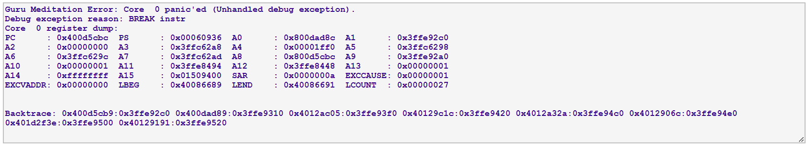
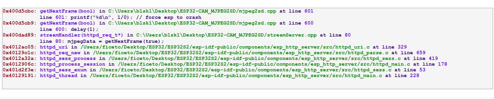

# EspCrashDecoder

The **EspCrashDecoder** is a standalone ESP exception decoder for use with the Arduino v2.x IDE.  
The original [EspExceptionDecoder](https://github.com/me-no-dev/EspExceptionDecoder) relies on an API which is not currently provided by the Arduino v2.x IDE.

## Design

The **EspCrashDecoder** comprises a `html` file that provides the user interface and parses the register trace to extract the instruction addresses that are passed to `gdb` for decoding, then formats the decoded output from `gdb`.  
The parsers and formatter are javascript conversions of the java methods from [EspExceptionDecoder](https://github.com/me-no-dev/EspExceptionDecoder).  
A Windows batch file provides the overall control.

## Installation

Copy the `EspCrashDecoder` folder to the Arduino sketch folder to be analysed.  

The **EspCrashDecoder** will work for ESP32, ESP32S2 and ESP32S3.  
If ESP32S2 or ESP32S3 is being used, change the `espTarget` and `elfTarget` variables in the `EspCrashDecoder.bat` file.  
Some boards may have a different `elfTarget` value, eg for ESP32 Pico D4 change `elfTarget` to `pico32` - check `build` folder in sketch.

It is assumed that the `arduino-esp32` core containing `gdb` is installed in the current user profile.

Only tested on the Chrome browser.

## Usage

Because the **EspCrashDecoder** is standalone it needs more steps than the [EspExceptionDecoder](https://github.com/me-no-dev/EspExceptionDecoder). 

If a crash occurs when running a sketch, a local ELF file needs to be created by pressing `Alt+Ctrl+S` (Export Compiled Binary) in the Arduino v2.x IDE loaded with the sketch.

Double click the `EspCrashDecoder.bat` file which brings up a web page to paste in the stack trace from the Arduino console. 

  

This creates a `gdb` batch file `EspCrashDecoder.txt` in the user profile `Downloads` folder, which is automatically applied to `gdb` by the `EspCrashDecoder.bat` file and directs the response to a `EspCrashDecoder.out` file in the `Downloads` folder.  
Press the button that has appeared on the browser page and navigate to and select the `EspCrashDecoder.out` file.  
(For browser security reasons the file has to be selected by the user).  
The formatted decoded output in then displayed on the browser.

## No Output

If the web page displays no output, check the contents of the file `err.txt` in the `EspCrashDecoder` folder: 
* `The system cannot find the path specified.` The path to `gdb` is not valid, possibly due to new version of `arduino-esp32` core.
* `No such file or directory.` The ELF file was not created, check instructions above.

